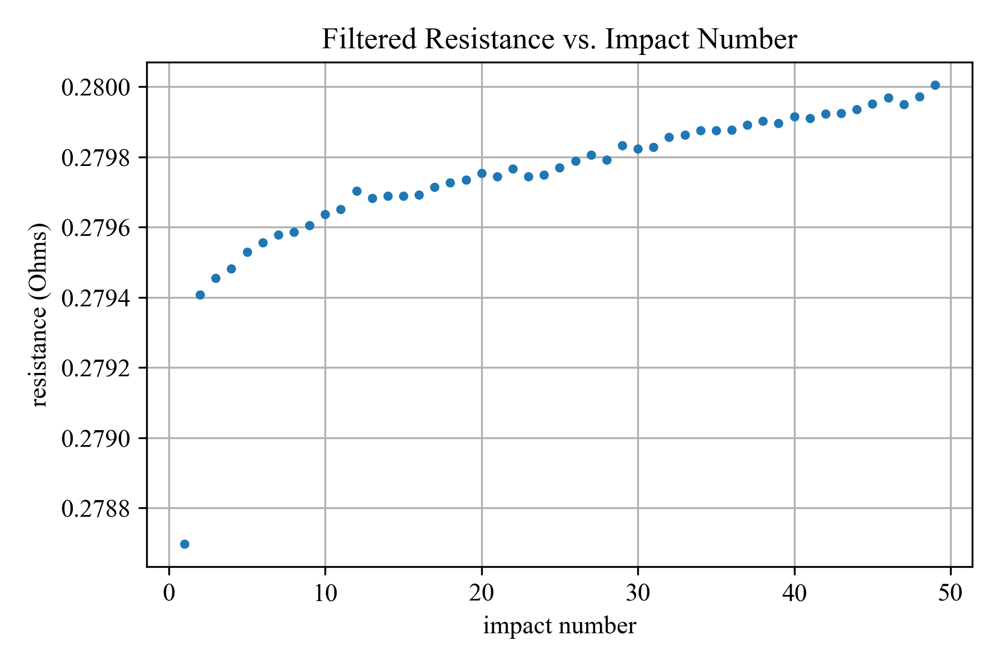

# Dataset-11-rectangular-electronic-assembly-under-repeated-5-kg-impacts
Data from set iteration 4 board 3. Failure occured after 49 impacts.

Figure 1: Resistance vs. impact number

Figure 2: Feature plot
