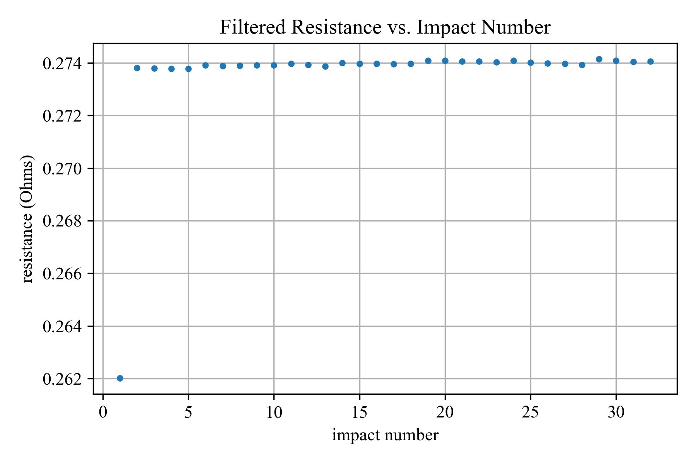
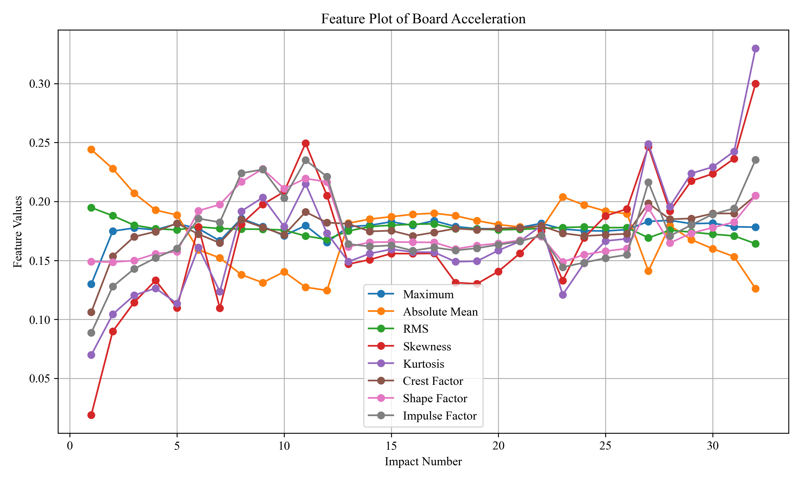

# Dataset-11-rectangular-electronic-assembly-under-repeated-5-kg-impacts
Data from set iteration 5 board 1. Failure occured after 32 impacts.

Figure 1: Resistance vs. impact number

Figure 2: Feature plot
